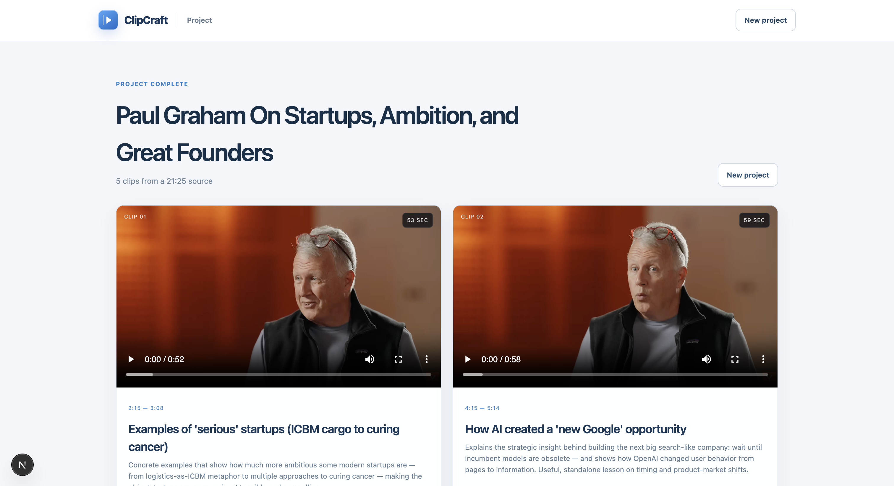

# ClipCraft

ClipCraft is an open-source, local-first web app that turns long-form YouTube videos into
focused, editable clips. It downloads a public video, transcribes it with OpenAI, identifies
strong standalone moments, and renders downloadable MP4 clips with FFmpeg.



## Features

- Generate key moments from long YouTube videos
- Keep clip boundaries aligned with complete thoughts
- Preview and download generated MP4 clips
- Edit trim points, aspect ratio, captions, fades, and zoom presets
- Burn synchronized word-level captions into exported clips
- Generate editable X post copy with transcript-verified quotes
- Sign in with Google or an email magic link
- Save an encrypted bring-your-own OpenAI API key
- View user-scoped project history
- Responsive Next.js interface with a FastAPI media pipeline
- Local job retention and automatic cleanup

## How it works

1. `yt-dlp` reads the video metadata and downloads the source.
2. FFmpeg extracts compressed audio in manageable chunks.
3. OpenAI Whisper produces segment- and word-level timestamps.
4. GPT selects compelling, self-contained moments from the transcript.
5. FFmpeg renders the selected ranges as H.264/AAC clips.
6. The editor can re-render a clip with captions, crops, fades, and zoom presets.

## Tech stack

- Next.js 16, React 19, TypeScript, and Tailwind CSS
- FastAPI, Pydantic, and Python 3.11+
- OpenAI Whisper and GPT models
- FFmpeg, FFprobe, and yt-dlp
- Vitest and pytest

## Requirements

- A current Node.js LTS release
- Python 3.11 or newer
- FFmpeg and FFprobe available on `PATH`
- An OpenAI API key

On macOS:

```bash
brew install ffmpeg
```

## Local setup

```bash
git clone <your-repository-url>
cd ClippingTool
npm install
npm run setup:api
cp .env.example .env
```

Create a Supabase project, apply the migration in
`supabase/migrations/20260906233000_accounts_history.sql`, and add its URL and publishable key to
the root `.env`:

```dotenv
SUPABASE_URL=https://your-project.supabase.co
SUPABASE_PUBLISHABLE_KEY=sb_publishable_...
APP_ENCRYPTION_KEY=...
```

Add the corresponding `NEXT_PUBLIC_SUPABASE_URL` and
`NEXT_PUBLIC_SUPABASE_PUBLISHABLE_KEY` values to `web/.env.local`. Enable email and Google under
Supabase Authentication Providers. Google OAuth must include this callback:

```text
https://your-project.supabase.co/auth/v1/callback
```

Start the frontend and API:

```bash
npm run dev
```

Open [http://localhost:3000](http://localhost:3000). The API runs at
[http://localhost:8000](http://localhost:8000), with interactive documentation at
[http://localhost:8000/docs](http://localhost:8000/docs).

If the API runs at a different URL, add `web/.env.local`:

```dotenv
NEXT_PUBLIC_API_URL=http://localhost:8000
```

## Commands

```bash
npm run dev          # start the web app and API
npm run lint         # run ESLint and Ruff
npm run test         # run Vitest and pytest
npm run build        # build the production frontend
npm run dev:web      # start only Next.js
npm run dev:api      # start only FastAPI
```

## Project structure

```text
web/                     Next.js frontend
web/src/app/             Product routes
web/src/components/      Job, editor, and shared UI
api/app/main.py          FastAPI routes
api/app/jobs.py          Job state and pipeline orchestration
api/app/services/        YouTube, OpenAI, and FFmpeg integrations
api/tests/               Backend tests
api/data/                Local generated data (gitignored)
```

## Clip editor

Newly generated clips include an editor with:

- original, portrait 9:16, and square 1:1 formats;
- transcript-driven clean, bold, and minimal caption styles;
- trim controls that remain within the original moment;
- fade and punch-zoom presets;
- an approximate browser preview and final FFmpeg export.

The source video is retained locally for 24 hours so edits do not require another download.
Projects created before editor support must be recreated before they can be edited.

## Privacy and security

The account layer is designed around user isolation:

- FastAPI validates Supabase sessions and scopes every project by authenticated user ID.
- OpenAI keys are encrypted with AES-256-GCM and bound to the owning user.
- Saved keys are decrypted only in API worker memory and are never returned to the browser.
- Database row-level security prevents users from reading another account's records.
- Clip URLs use expiring signatures instead of relying on an unprotected UUID.
- Source video, transcripts, and clips are stored under `api/data/`.
- Jobs are deleted after the configured retention period, which defaults to 24 hours.

The remaining production limitation is media infrastructure: FFmpeg jobs and files still use the
local API process and disk. Do not scale the API horizontally until jobs move to a durable worker
and object storage.

## Product roadmap

The next production milestone is:

- PostgreSQL-backed job metadata
- Durable background workers
- Cloudflare R2 media storage
- Docker images and continuous integration

## Contributing

Contributions are welcome. Before opening a pull request:

1. Create a focused branch.
2. Add or update tests for behavior changes.
3. Run `npm run lint`, `npm run test`, and `npm run build`.
4. Describe the user-facing change and any deployment implications.

For substantial features, open an issue first so the design and scope can be discussed.

## Responsible use

Only process videos you own or have permission to use. You are responsible for complying with
copyright law and the terms of the source platform. YouTube's terms restrict downloading or
modifying content unless the service or relevant rights holders authorize it. A public deployment
should consider direct uploads as the primary ingestion method.

## License

ClipCraft is available under the [MIT License](LICENSE).
